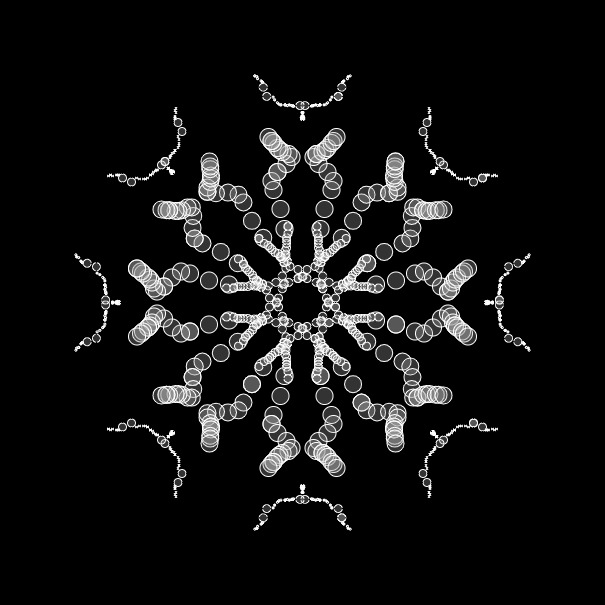
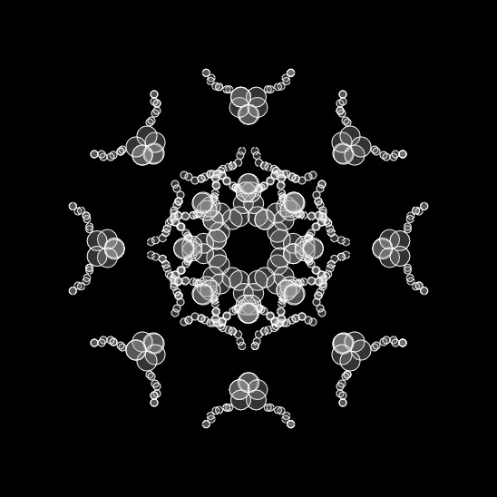
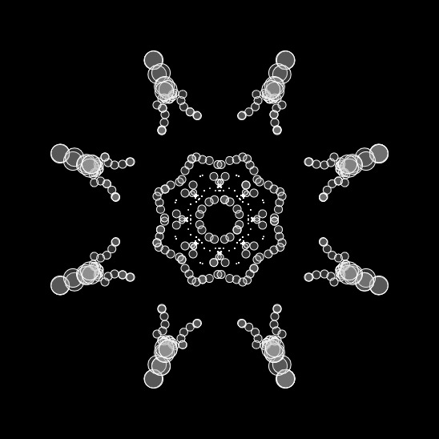
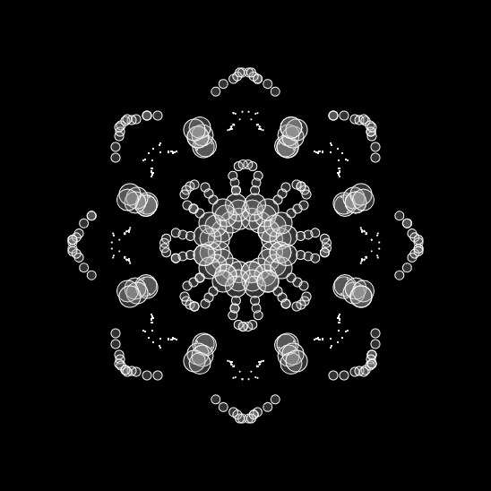
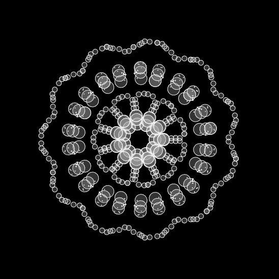
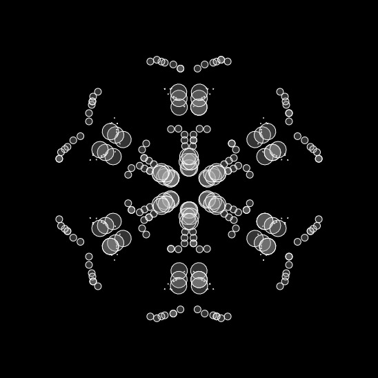

# Snowflake - V1.1 - Processing 5 example

Simple example the [Processing p5](https://p5js.org/) JavaScript library for artists, designers, educators, beginners, and anyone else!

## Background

The application can be used to draw snowflakes.

## Install

Download files, and open the index.html file in browser.

## Usage

Click on the canvas with the mouse.
Press Q or A and the radius of the circle increases or decreases.
Press the UP or DOWN button to change the number of mirror.
Press the S and save canvas to file.

## Example

